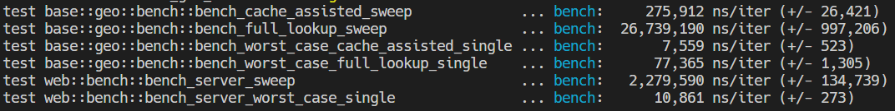
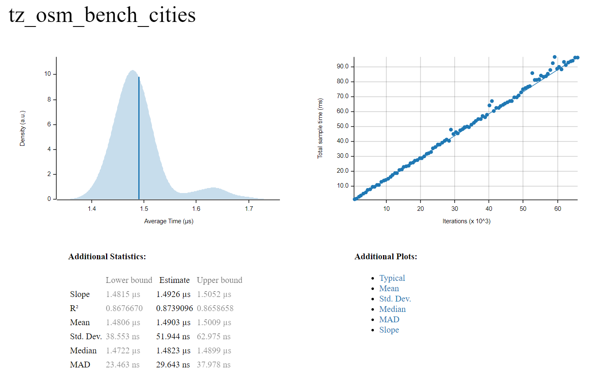
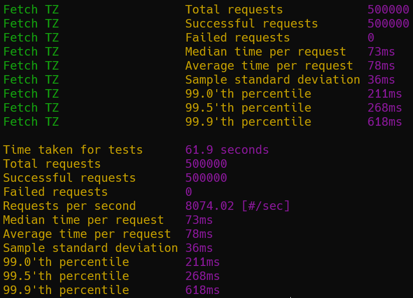
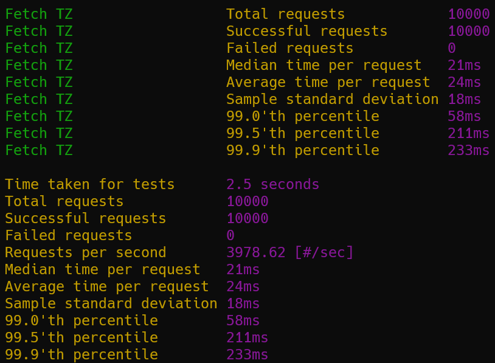

[](https://github.com/twitchax/rtz/actions/workflows/build.yml)
[](https://codecov.io/gh/twitchax/rtz)
[](https://crates.io/crates/rtz)
[](https://crates.io/crates/rtz)
[](https://github.com/twitchax/rtz/releases)
[](https://www.npmjs.com/package/rtzweb)
[](https://docs.rs/rtz)
[](https://github.com/twitchax/rtz)
[](https://opensource.org/licenses/MIT)

# rtz

A self-contained geo lookup library / binary / server for Rust / JS (via WASM) ([free server](http://tz.twitchax.com/api/v1/osm/tz/30/30)) using data from the [Natural Earth](https://www.naturalearthdata.com/) and [OpenStreetMap](https://www.openstreetmap.org/) datasets.

## Free Server

The server is deployed to four regions across the globe, and is available at [tz.twitchax.com](http://tz.twitchax.com/api/v1/osm/tz/30/30).  Each region is currently 
capable of supporting around 8,000 RPS, and is deployed to the following regions: sea, iad, ams, hkg.

In addition, the server will now generally attempt to not break backwards compatibility within an api version.  This means that the server will (attempt to) not change the response format for a given api version, and will (attempt to) not remove any fields from the response.  This does not mean that the server will not add fields to the response, but it will (attempt to) not remove them.

Requests take the form of `http://tz.twitchax.com/api/v1/osm/tz/{lng}/{lat}`.  You can also check out the [api docs](http://tz.twitchax.com/rapidoc) to explore other endpoints and versioning strategy.

Example request:

```bash
$ curl http://tz.twitchax.com/api/v1/osm/tz/30/30

[{"id":12,"identifier":"Africa/Cairo","shortIdentifier":"EEST","offset":"UTC+03:00","rawOffset":10800,"rawBaseOffset":7200,"rawDstOffset":3600,"zone":3.0,"currentTime":"2023-07-25T23:39:59.385469400+03:00"}]
```

HTTPS is also available, but is not recommended due to the performance overhead for the client and the server, and the lack of sensitive data being transmitted.

## Binary Usage

### Install

Releases attach the binaries directly, so there is nothing to unpack.

Windows:

```powershell
$ iwr https://github.com/twitchax/rtz/releases/latest/download/rtz-x86_64-pc-windows-gnu.exe -OutFile rtz.exe
```

Mac OS (Apple Silicon):

```bash
$ curl -Lo /usr/local/bin/rtz https://github.com/twitchax/rtz/releases/latest/download/rtz-aarch64-apple-darwin
$ chmod a+x /usr/local/bin/rtz
```

Linux:

```bash
$ curl -Lo /usr/local/bin/rtz https://github.com/twitchax/rtz/releases/latest/download/rtz-x86_64-unknown-linux-gnu
$ chmod a+x /usr/local/bin/rtz
```

Cargo:

```bash
$ cargo install rtz
```

NPM:

```bash
$ npm install --save rtzweb
```

### Help Docs

```bash
$ rtz

A tool to easily work with geo lookups via a binary, a library, or a server.

Usage: rtz [COMMAND]

Commands:
  ned           The Natural Earth Data dataset based operations
  osm           The OpenStreetMap dataset based operations
  dump-geojson  Resolve a timezone from a lng,lat pair using the OSM dataset
  serve         Serve the timezone API
  help          Print this message or the help of the given subcommand(s)

Options:
  -h, --help     Print help
  -V, --version  Print version
```

### Resolve a Time Zone

```bash
$ rtz ned tz "-87.62,41.88"

Identifier:      America/Chicago
UTC Offset:      UTC-06:00
Offset Seconds:  -21600
Description:     Canada (almost all of Saskatchewan), Costa Rica, El Salvador, Ecuador (Galapagos Islands), Guatemala, Honduras, Mexico (most), Nicaragua,
DST Description: Canada (Manitoba), United States (Illinois, most of Texas)
```

### Run with Wasmtime

Each release ships a [WASI Preview 2](https://component-model.bytecodealliance.org/) component as a
release asset (`rtz-wasm32-wasip2.wasm`). Grab it from the [latest
release](https://github.com/twitchax/rtz/releases/latest) and run it with any component-capable
runtime:

```bash
wasmtime run rtz-wasm32-wasip2.wasm ned tz 30,30
```

> Older versions were also published to wasmer (`wasmer run twitchax/rtz@latest`). That channel is
> deprecated and frozen at `0.8.0` — wasmer's runtime does not execute Preview 2 components yet.
> Prefer the component above, or the native binaries attached to each release.

### Run the Server

```bash
$ cargo install rtz --features web
$ rtz serve
```

```bash
$ docker run -it --rm -p 8082 twitchax/rtz
```

## Library Usage

Add this to your `Cargo.toml`:

```toml
[dependencies]
rtz = "*" #choose a version
```

### Examples

```rust
use rtzlib::NedTimezone;
use rtzlib::CanPerformGeoLookup;

// Query a time zone for a given `(lng,lat)`.
assert_eq!(
    NedTimezone::lookup(-121., 46.)[0]
        .identifier
        .as_ref()
        .unwrap(),
    "America/Los_Angeles"
);
```

## JS Usage

The npm package is available [here](https://www.npmjs.com/package/rtzweb).

First, load the module as you would any other ES module.

```js
import * as rtz from 'rtzweb/rtzlib.js';
```

Then, you can use the library similarly as you would in Rust.  Each lookup returns an array of
matches (a `(lng,lat)` can fall in more than one zone), and the package ships TypeScript
definitions generated from the Rust response types.

```js
let tzs = rtz.getTimezoneNed(-121, 46);
tzs[0].identifier; // "America/Los_Angeles"
tzs[0].rawOffset;  // -28800
```

> **Breaking change in `0.8.0`.** These bindings previously returned a JSON *string*, so consumers
> had to `JSON.parse` the result — and the example above (documented since the first release)
> silently evaluated to `undefined`. They now return real JS objects. If you were parsing the
> result, drop the `JSON.parse`; if you were on `0.7.0` or earlier and reading `.identifier`
> directly, it works now.

## Feature Flags

The library and binary both support various feature flags.  These are the available flags:
* Top-Level:
  * `default = ["cli"]`
  * `full = ["tz-ned", "tz-osm", "admin-osm", "self-contained"]`
* Datasets:
  * `tz-ned`: enables the [Natural Earth](https://www.naturalearthdata.com/) time zone dataset, and the associated produced library functions.
  * `tz-osm`: enables the [OpenStreetMap](https://www.openstreetmap.org/) time zone dataset, and the associated produced library functions.
  * `admin-osm`: enables the [OpenStreetMap](https://www.openstreetmap.org/) administrative dataset, and the associated produced library functions.
* Binary configuration:
  * `cli`: enables the CLI features, and can be removed if only compiling the library.
  * `self-contained`: enables the self-contained features, which build with datasets embedded into the binary.
  * `double-precision`: uses `f64`s everywhere for `Geometry` and `Polygon` data types, which is more accurate but fatter than `f32`s.
  * `unsimplified`: produces unsimplified data caches.  Requires more binary / memory overhead, but is more accurate.  Uses the level of detail from the original dataset.  The default is to simplify to an epsilon of `0.0001` (generally).
  * `extrasimplified`: produces extrasimplified data caches.  Requires less binary / memory overhead, but is less accurate.  This sets the simplification epsilon to `0.01` (generally).
  * `owned-decode`: uses `owned` instead of `borrow` for the `decode` feature of the `bincode` crate.  This increases memory footprint by not mapping the data directly from the binary, but is less `unsafe`-y / dark arts-y.
* Special Modifiers:
  * `wasm`: enables the WASM features, and is required to build an NPM package via `wasm-pack`, or produce `wasi` binaries.
  * `web = ["full"]`: enables the `serve` subcommand, which starts a Rocket web server that can respond to time zone requests.
* Other Considerations:
  * `wasm` / `wasi` builds currently do not play nice with `reqwest` and `zip`, so the `wasm` / `wasi` builds require the `self-contained` feature.

## Data Updates

The committed datasets (`rtz/assets/*.bincode`) were last generated 2024.08.08.  They are not refreshed automatically — the refresh pipeline below exists to regenerate them on demand, from the latest upstream sources:
* [OSM Admin Data](https://planet.openstreetmap.org/pbf/planet-latest.osm.pbf).  This data is downloaded from the OSM planet file, and is then [processed](https://github.com/AndGem/osm_extract_polygon) locally to extract the administrative boundaries.
* [OSM TZ Data](https://github.com/evansiroky/timezone-boundary-builder/releases/download/2026c/timezones-with-oceans.geojson.zip).  This data is downloaded from the latest generated release of the timezone boundary builder, and is processed automatically by this code.
* [NED TZ Data](https://raw.githubusercontent.com/nvkelso/natural-earth-vector/master/geojson/ne_10m_time_zones.geojson).  This data is downloaded from the `master` branch of the NED vector repository, and is processed automatically by this code.

To refresh the committed bincodes to the latest sources, run:

```bash
$ cargo xtask update
```

This pulls NED `master`, OSM-tz `2026c`, and the latest `planet-latest.osm.pbf`; extracts admin boundaries via [`osm_extract_polygon`](https://github.com/AndGem/osm_extract_polygon); regenerates all six `rtz/assets/*.bincode` files; and verifies they decode via the test suite. It's a multi-hour, ~80GB-download job — see `cargo xtask --help` and the `update-data` skill (`.claude/skills/update-data/SKILL.md`) for prerequisites and the individual `download-pbf` / `extract-admin` / `regen` / `verify` subcommands.

The OSM admin data source is the `RTZ_OSM_ADMIN_DIRS` environment variable (a semicolon-separated list of GeoJSON directories) rather than a hardcoded path; `cargo xtask regen` sets it for you from the directories `extract-admin` produces.

## Performance

### General

This implementation trades binary size for performance by employing an in-binary cache that improves average timezone resolution by about 96x, and worst-case resolution by about 10x.  Average timezone lookup time is around `930 ns` using the OSM dataset, and around `460 ns` for the NED dataset.  Worst-case lookup time is around `6 - 10 μs`.



On average, for random cities, the OSM dataset lookup time is around `1.5 μs`, and the NED dataset lookup time is around `400 ns`.



### Free Server

Below is the sample performance to resolve a time zone from a `(lng,lat)` pair to one of the data centers using a concurrency of 1,000, achieving 8,000 RPS.



Below is the sample performance to resolve a time zone from a `(lng,lat)` pair to one of the data centers using a concurrency of 100, achieving an average response time of `24 ms`.



## Test

```bash
cargo test --features web
```

## Bench

```bash
cargo bench --features web
```

## License

MIT